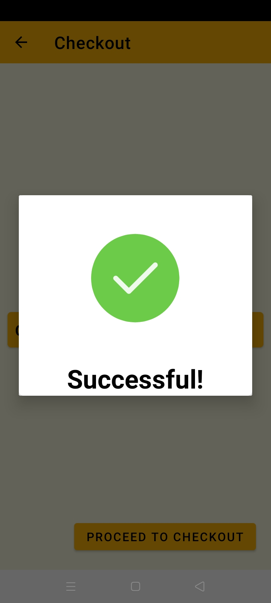

# An android based application (Created using Android Framework, Java Web and MySql)
  
 

# Purpose
  - The purpose of this application is to create Mobile Application and Web Application for Sales, Inventory, and Ordering 
    of BGC Seedlings Supply Company
  - Design and implement a mobile and web-based e-commerce application
  
 
  
# Features
  - Order products 
  - Login form 
  - Signup form
  - Viewing of products 
  - Educational tutorials on each product 
  - Tracking of order status 
  - User Profile 

   
# Screenshots
<table>
  <tr>
   
      
     
 </tr>
 <tr>
   
   
      
 </tr>
  <tr>
   
   
      
 </tr>
   <tr>
   
   
      
 </tr>
   <tr>
   
     
      
 </tr>
</table>
  
